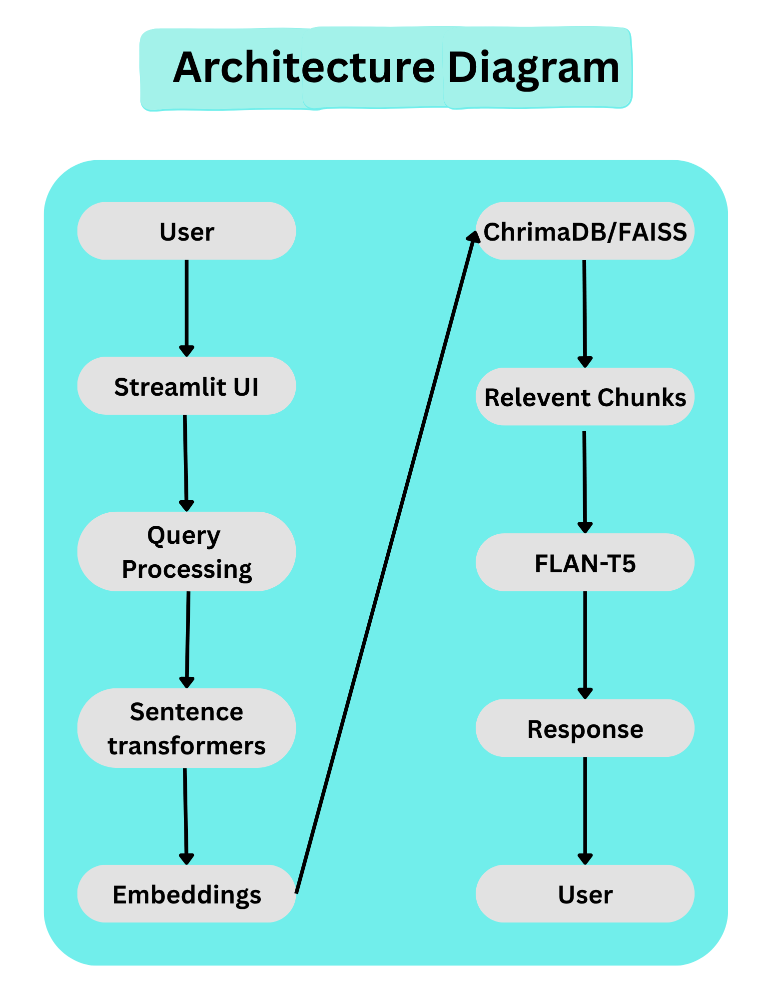

# 💬 NUST Q&A Assistant

Developed an **LLM-powered university knowledge assistant** with semantic retrieval, fuzzy matching, and a Streamlit UI, improving answer relevance for student handbook queries.  
The interface is styled like a WhatsApp chat, with preserved conversation history, clickable suggestion bubbles, and dark/light mode support.
## 🚀 Live Demo
[NUST Assistant on Streamlit Cloud](https://nustassistant-llm.streamlit.app/)

---

## 📖 Introduction
This project demonstrates how **Generative AI** can be integrated into educational support tools.  
It allows users to upload a CSV handbook of Q&A pairs and interact conversationally with the assistant.  
By combining **embeddings, RAG (Retrieval-Augmented Generation), and Hugging Face models**, the app ensures accurate answers even when questions are paraphrased.

---

## 🚀 Features
- Upload a CSV file with Q&A pairs
- Natural language queries with semantic retrieval
- WhatsApp-style chat bubbles with preserved history
- Sidebar memory of asked questions
- Dark/light mode styling
- Accurate answer retrieval using embeddings + normalization
- Dynamic suggestion bubbles that refresh after each answer
- Prevents duplicate Q&A pairs
- Inline “Send” button inside the input bar

## 📂 Project Structure
nust_dashboard/
│
├── app.py              # Entry point
├── backend.py          # Models + logic (embeddings, RAG, answer retrieval)
├── ui.py               # Streamlit UI (WhatsApp-style interface)
├── data/Handbook.csv   # Dataset of questions/answers
├── requirements.txt    # Dependencies
├── screenshots/        # UI screenshots
├── assets/             # Architecture diagram + demo video
└── README.md           # Documentation

## 🛠️ Tech Stack & Models
- **[Streamlit](ca://s?q=Explain_Streamlit)** → interactive web app framework  
- **[Pandas](ca://s?q=Explain_Pandas)** → CSV data handling  
- **[PyTorch](ca://s?q=Explain_PyTorch)** → deep learning backbone  
- **[Sentence Transformers](ca://s?q=Explain_Sentence_Transformers)** → embeddings for semantic similarity  
- **[Hugging Face Transformers](ca://s?q=Explain_Hugging_Face_Transformers)** → tokenizer + model loading  
- **[FLAN‑T5](ca://s?q=Explain_FLAN_T5_model)** → LLM for generative responses  
- **[Cosine Similarity](ca://s?q=Explain_Cosine_Similarity)** → semantic matching between queries and handbook Q&A  
- **Vector Databases (FAISS, ChromaDB)** → scalable retrieval layer  
- **LangChain & LlamaIndex** → orchestration frameworks for modular RAG pipelines  
- **Google Gemini API (future)** → richer generative responses  

---

## 📊 Architecture

**Flow:**  
User → Streamlit UI → Query Processing → Sentence Transformers → Embeddings → ChromaDB/FAISS → Relevant Chunks → FLAN‑T5 → Response → User

---

## 📸 Screenshots
  
  
  

---

## 🔧 Challenges Faced
- Hallucinations in generated responses  
- Poor chunk retrieval with paraphrased queries  
- Token limit issues  
- Embedding mismatch  

## ✅ Solutions Implemented
- Recursive chunking for better context  
- Improved prompt engineering  
- Cosine similarity + threshold filtering  
- Context-aware retrieval pipeline  

## 📚 Lessons Learned
- Importance of embeddings in semantic search  
- Vector database optimization (FAISS, ChromaDB)  
- Designing robust RAG pipelines  
- Effective prompt engineering strategies  

---

## 🌟 Future Improvements
- Multi-PDF support for broader knowledge bases  
- Voice assistant integration  
- Gemini API experimentation for advanced generative responses  

---

## 📌 GitHub
Repository: [NUST Dashboard](https://github.com/UmerQureshiiii-svg/nust_dashboard)
